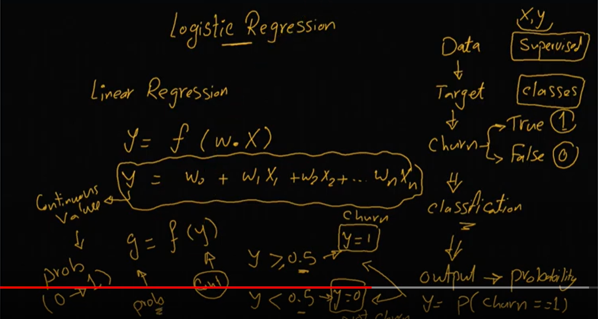
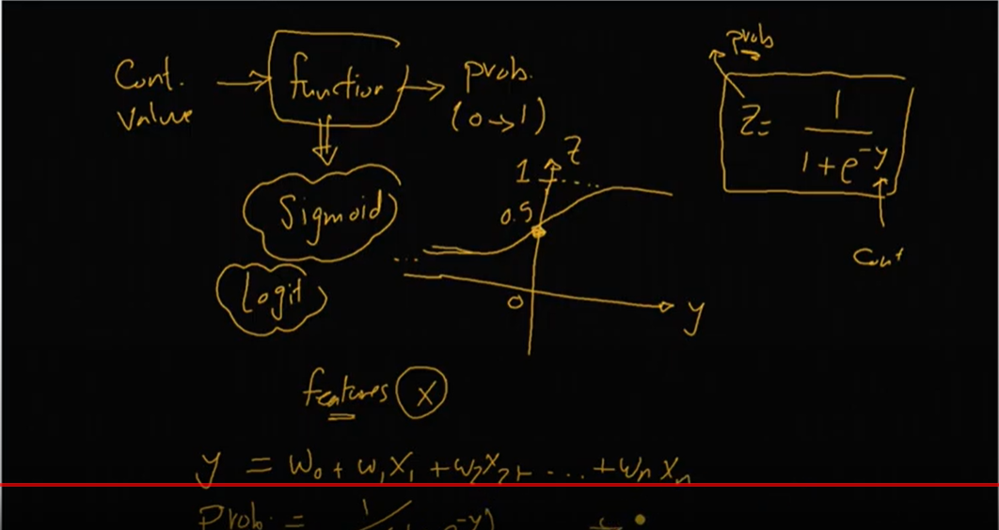
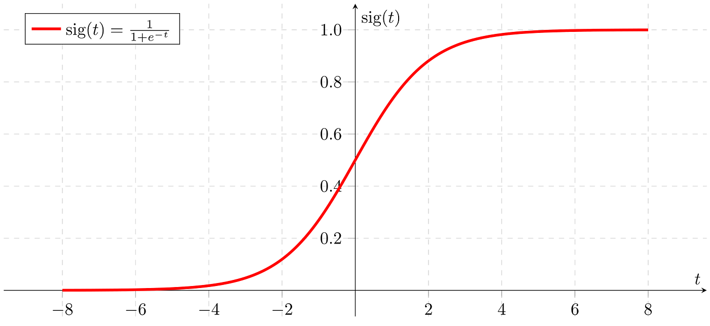
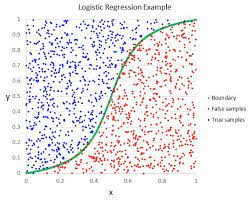

# Churn Classification
Churn Classification Using Logistic Regression (Supervised Learning)

## Explanation
  
  

## A sigmoid function:
### - is a bounded, differentiable, real function that is defined for all real input values and has a non-negative derivative at each point and exactly one inflection point. A sigmoid "function" and a sigmoid "curve" refer to the same object.

  
  
  
  
  
